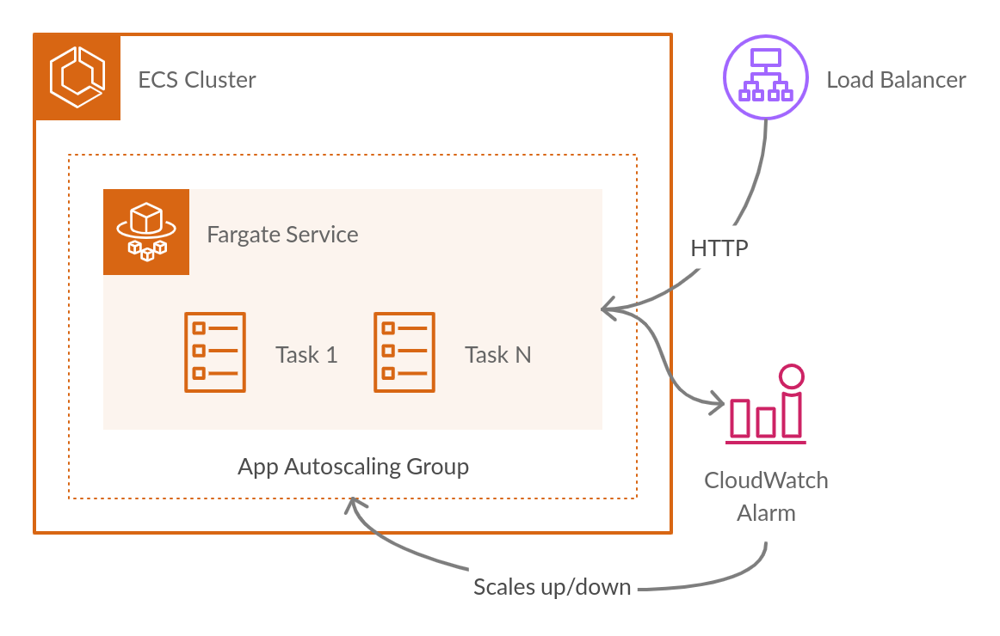

# Terraform AWS ECS Fargate Service



## Usage

```tf
module "ecs_fargate_service" {
  source  = "app.terraform.io/oowlish/ecs-fargate-service/aws"
  version = "~> 1.0"

  name  = "wordpress"
  stage = "beta"
  
  tags = {
    Application  = "blog"
    Environment  = "nonprod"
    Stage        = "beta"
    Organization = "acme"
  }

  vpc_id             = "vpc-xxxxxx"
  private_subnet_ids = ["subnet-aaaaaa", "subnet-bbbbbb"]
  public_subnet_ids  = ["subnet-xxxxxx", "subnet-zzzzzz"]
  
  ecs_assign_public_ip                   = false
  ecs_cluster_name                       = "ecs-cluster"
  ecs_container_name                     = "webserver"
  ecs_container_port                     = 80
  ecs_deployment_maximum_percent         = 200
  ecs_deployment_minimum_healthy_percent = 100
  ecs_desired_count                      = 2
  ecs_health_check_grace_period_seconds  = 0
  ecs_security_group_ids                 = ["sg-xxxxxx"]
  ecs_task_definition_arn                = "wordpress:1"
  
  lb_health_check_enabled             = true
  lb_health_check_healthy_threshold   = 3
  lb_health_check_interval            = 30
  lb_health_check_matcher             = "200-299"
  lb_health_check_path                = "/"
  lb_health_check_timeout             = 5
  lb_health_check_unhealthy_threshold = 3
  
  appautoscaling_high_cpu_threshold    = 65
  appautoscaling_low_cpu_threshold     = 15
  appautoscaling_max_capacity          = 10
  appautoscaling_min_capacity          = 2
  appautoscaling_scale_down_adjustment = -1
  appautoscaling_scale_down_cooldown   = 150
  appautoscaling_scale_up_adjustment   = 2
  appautoscaling_scale_up_cooldown     = 60
}
```

## Requirements

| Name | Version |
|------|---------|
| terraform | ~> 0.12 |

## Providers

| Name | Version |
|------|---------|
| aws | n/a |
| random | n/a |

## Inputs

| Name | Description | Type | Default | Required |
|------|-------------|------|---------|:--------:|
| appautoscaling\_high\_cpu\_threshold | The value against which the specified statistic is compared. This parameter is required for alarms based on static thresholds, but should not be used for alarms based on anomaly detection models. | `number` | `65` | no |
| appautoscaling\_low\_cpu\_threshold | The value against which the specified statistic is compared. This parameter is required for alarms based on static thresholds, but should not be used for alarms based on anomaly detection models. | `number` | `15` | no |
| appautoscaling\_max\_capacity | The max capacity of the scalable target. | `number` | `10` | no |
| appautoscaling\_min\_capacity | The min capacity of the scalable target. | `number` | `2` | no |
| appautoscaling\_scale\_down\_adjustment | The number of members by which to scale, when the adjustment bounds are breached. A positive value scales up. A negative value scales down. | `number` | `-1` | no |
| appautoscaling\_scale\_down\_cooldown | The amount of time, in seconds, after a scaling activity completes and before the next scaling activity can start. | `number` | `150` | no |
| appautoscaling\_scale\_up\_adjustment | The number of members by which to scale, when the adjustment bounds are breached. A positive value scales up. A negative value scales down. | `number` | `2` | no |
| appautoscaling\_scale\_up\_cooldown | The amount of time, in seconds, after a scaling activity completes and before the next scaling activity can start. | `number` | `60` | no |
| ecs\_assign\_public\_ip | Whether to assign a public IP to the Fargate tasks. | `bool` | `false` | no |
| ecs\_cluster\_name | Name of an existing ECS Cluster. | `string` | n/a | yes |
| ecs\_container\_name | The container name value, already specified in the task definition, to be used for your service discovery service. | `string` | n/a | yes |
| ecs\_container\_port | The port value, already specified in the task definition, to be used for your service discovery service. | `number` | `80` | no |
| ecs\_deployment\_maximum\_percent | The upper limit (as a percentage of the service's desiredCount) of the number of running tasks that can be running in a service during a deployment. | `number` | `200` | no |
| ecs\_deployment\_minimum\_healthy\_percent | The lower limit (as a percentage of the service's desiredCount) of the number of running tasks that must remain running and healthy in a service during a deployment. | `number` | `100` | no |
| ecs\_desired\_count | The number of instances of the task definition to place and keep running. | `number` | `2` | no |
| ecs\_health\_check\_grace\_period\_seconds | Seconds to ignore failing load balancer health checks on newly instantiated tasks to prevent premature shutdown, up to 2147483647. | `number` | `0` | no |
| ecs\_security\_group\_ids | A list of security groups associated with the task or service. | `list(string)` | n/a | yes |
| ecs\_task\_definition\_arn | The family and revision (family:revision) or full ARN of the task definition that you want to run in your service. | `string` | n/a | yes |
| lb\_health\_check\_enabled | The number of consecutive health checks successes required before considering an unhealthy target healthy. | `bool` | `true` | no |
| lb\_health\_check\_healthy\_threshold | The number of consecutive health checks successes required before considering an unhealthy target healthy. | `number` | `3` | no |
| lb\_health\_check\_interval | The approximate amount of time, in seconds, between health checks of an individual target. Minimum value 5 seconds, Maximum value 300 seconds. | `number` | `30` | no |
| lb\_health\_check\_matcher | The HTTP codes to use when checking for a successful response from a target. You can specify multiple values (for example, "200,202") or a range of values (for example, "200-299"). | `string` | `"200-299"` | no |
| lb\_health\_check\_path | The destination for the health check request. | `string` | `"/"` | no |
| lb\_health\_check\_timeout | The amount of time, in seconds, during which no response means a failed health check. The range is 2 to 120 seconds, and the default is 5 seconds. | `number` | `5` | no |
| lb\_health\_check\_unhealthy\_threshold | The number of consecutive health check failures required before considering the target unhealthy. | `number` | `3` | no |
| name | Name of the ECS Service. | `string` | n/a | yes |
| private\_subnet\_ids | A list of private subnets. | `list(string)` | `[]` | no |
| public\_subnet\_ids | A list of public subnets. | `list(string)` | `[]` | no |
| stage | Stage of the ECS Service, e.g staging, beta, qa, prod. | `string` | n/a | yes |
| tags | Key-value map of resource tags. | `map(string)` | n/a | yes |
| vpc\_id | The identifier of the VPC in which to create the resources. | `string` | n/a | yes |

## Outputs

| Name | Description |
|------|-------------|
| this\_ecs\_service\_name | n/a |
| this\_lb\_dns\_name | n/a |
